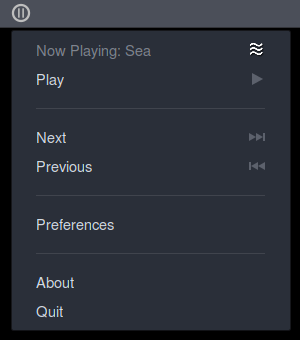

################
ANoise Indicator
################

AppIndicator is an alternative GUI for ANoise (Ambient Noise) application
[http://anoise.tuxfamily.org]. It provide a more integrated experience,
moving all the ANoise features in an easy drop down menu and disabling MPRIS
integration.

Features
========

* Integrates with existing ANOise GUI
* Show currently playing noise
* Simple dropdown menu with, Play, Pause, Next, Preferences
* Middle click (or both buttons) plays and pauses
* Disable MPRIS integration to avoid having media keys interfere with your
  relaxation and focus time
* Works with ANoise Preferences and everything it offe

Caveats
=======

* Replaces built-in GUI (runs in it's place)
* Disable MPRIS integration

Screenshots
===========

License
=======

Licensed under the GLP 3 License.
